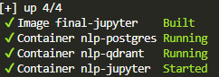

# **TITLE : `Not-Selected`**


> This Project Maintain by Github Action (CI/CD) for NLP Model Deployment and API Testing.

## **Account**

- **Email**: [nlp.aiub.101@gmail.com](mailto:nlp.aiub.101@gmail.com)
- **Password**: **Nlp101!##**

## NLP Project Timeline

| ID | Phase | Start Date | End Date | Status |
| --- | --- | --- | --- | --- |
| 1 | Planning | April 13 | April 16 | 🟡 |
| 6 | Coding | April 13 | April 28 | 🎯 |
| 2 | Design | April 17 | April 19 | ⏳ |
| 3 | Backend | April 20 | April 22 | ⏳ |
| 4 | Frontend | April 23 | April 25 | ⏳ |
| 5 | Testing | April 26 | April 27 | ⏳ |
| 6 | Delivery | April 28 | April 28 | ⏳ |

> Completed (✅), In Progress (🟡), Pending (⏳), Milestone (🎯)

## **Course Details**

- **Name**: Natural Language Processing (**NLP**)
- **Code**: CSC 4233
- **Institution**: American International University-Bangladesh (**AIUB**)
- **Semester**: Spring 2025-2026
- **Instructor**: [Dr. Md. Saef Ullah Miah](https://ping543f.github.io)

## System Requirements

- **Docker Desktop**: For multi-container orchestration
- **Oparating System**: Windows 10/11 (64-bit)
- **RAM**: Minimum 8GB (16GB recommended)
- **CPU**: Intel i5/Ryzen 5 or higher
- **GPU**: NVIDIA with CUDA support (optional but recommended for deep learning)

## **Visual Studio Code Extension (Must)**

## Must Needed Extensions for NLP Project

- FastAPI Extension, DotENV, ESLint, ES7+                                                     (Must)
- Rainbow CSV, Ruff, Shell Runner                                                             (Must)
- vscode-pdf, WSL, markdownlint, npm Intellisense                                             (Must)
- Tailwind CSS IntelliSense, Tailwind Fold, ty                                                (Optional)
- Jupyter, Jupyter Cell Tags, Jupyter Keymap, Jupyter Notebook Renderers, Jupyter Slide Show  (Must)
- Pylance, Pytest IntelliSense, Python, Python Debugger, Python Environments                  (Must)

## For Docker and Containerization

- Docker, Docker DX, Docker Extension Pack, Docker Run                                        (Must)
- Container Tools, Dev Containers, DevDb                                                      (Must)
- Docker-IPython, Docker-Live                                                                 (Optional)  

## Project Hosting platforms

- **Backend**: [FastAPI](https://fastapicloud.com)
- **Frontend**: [Next.js](https://nextjs.org/)
- **Database**: [Supabase](https://supabase.com/)
- **Vector DB**: [Pinecone](https://www.pinecone.io/)
- **Model Hosting**: [HuggingFace](https://huggingface.co/spaces) or [Replicate](https://replicate.com/)

## Docker Setup

### 1.0 ⚒️ Build Docker Contaner

```bash
docker build -t nlp:latest .
```

### 1.1 ✨ Run Docker Contaner

```bash
docker run -d -p 8000:8000 nlp:latest
```

### 1.2 ⚖️ Check Libraries

```bash
docker exec -it nlp-container bash && 
pip list | grep -E 'transformers|torch|torch-geometric|fastapi|tensorflow|sklearn|nltk'
```

### 1.3 🌐 Activate NLP Service

```bash
docker compose up -d --build && docker compose ps
```



### 1.4 🎦 Watch NLP Server `Logs`

```bash
docker compose logs -f nlp &&
docker compose logs -f jupyter
```

### 1.5 🌐 Access Point for NLP Server

- [Fastapi](http://localhost:8000)
- [Jupyter Notebook](http://localhost:8888/)

### Test API (Unit Test)

```bash
cd tests & pytest test_api.py
# or in docker
docker compose exec nlp sh -lc "cd /app && PYTHONPATH=/app pytest -q"
```

> Test API with `Manualy` for High Stabalaty and Performance
