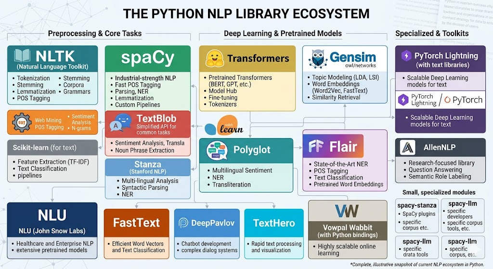

# **TITLE : `Not-Selected`**



## **Account**

- **Email**: [nlp.aiub.101@gmail.com](mailto:nlp.aiub.101@gmail.com)
- **Password**: **Nlp101!##**

## NLP Project Timeline

| ID | Phase | Start Date | End Date | Status |
| --- | --- | --- | --- | --- |
| 1 | Planning | April 13 | April 16 | 🟡 |
| 6 | Coding | April 13 | April 28 | 🎯 |
| 2 | Design | April 17 | April 19 | ⏳ |
| 3 | Backend | April 20 | April 22 | ⏳ |
| 4 | Frontend | April 23 | April 25 | ⏳ |
| 5 | Testing | April 26 | April 27 | ⏳ |
| 6 | Delivery | April 28 | April 28 | ⏳ |

> Completed (✅), In Progress (🟡), Pending (⏳), Milestone (🎯)

## **Course Details**

- **Name**: Natural Language Processing (**NLP**)
- **Code**: CSC 4233
- **Institution**: American International University-Bangladesh (**AIUB**)
- **Semester**: Spring 2025-2026
- **Instructor**: [Dr. Md. Saef Ullah Miah](https://ping543f.github.io)

## System Requirements Online

- **Google Colab**: For online codebase and experimentation.
- **Docker**: For deployment and reproducibility
- **RAM**: 16GB ++
- **Storage**: 50GB Google Drive for dataset + model weights
- **Python**: 3.11+
- **AI Libraries**: [`HuggingFace`](https://huggingface.co/transformers/), [`PyTorch`](https://pytorch.org/), [`Pytorch Geometric`](https://pytorch-geometric.readthedocs.io/en/latest/),  [`FastAPI`](https://fastapi.tiangolo.com/) & [`Streamlit`](https://streamlit.io/) .

### Included AI / Web Stack

- `FastAPI` for backend APIs
- `TensorFlow` for deep learning workflows
- `scikit-learn` for classical ML and evaluation
- `FastAPI Cloud` for cloud deployment support

## Server Hosting

- **Only Backend**: [FastAPI](https://fastapicloud.com)
- **Frontend**: [Next.js](https://nextjs.org/)
- **Database**: [Supabase](https://supabase.com/)
- **Vector DB**: [Pinecone](https://www.pinecone.io/)
- **Model Hosting**: [HuggingFace Spaces](https://huggingface.co/spaces) or [Replicate](https://replicate.com/)

## Docker Setup (Windows 10/11)

### PROJECT STRUCTURE: `MVC`

## 1.0 `Build`: Docker Contaner

```bash
docker build -t nlp:latest .
```

### 1.2 Check Libraries ✅

```bash
pip list | grep -E 'transformers|torch|torch-geometric|fastapi|streamlit|tensorflow|tensorboard|sklearn|nltk'
```

### 1.3 Run FastAPI ✅

```bash
docker compose logs -f nlp
```

### 1.4 Run streamlit ❌

```bash
docker compose exec -d nlp streamlit run streamlit_app.py --server.address 0.0.0.0 --server.port 8501
```

### 1.5 Run TensorBoard for `Model Performance Dashboard` ❌

```bash
docker compose exec -d nlp tensorboard --logdir /app/runs --host 0.0.0.0 --port 6006
```

### 1.6 Run Jupyter Notebook

```bash
docker compose up -d --build jupyter & docker compose logs -f jupyter
```

## 2.0 Start Server ✅

```bash
docker compose up -d --build
```

## 2.1 Docker Terminal (Get Access) ✅

```bash
docker exec -it nlp-container bash
```

### Links to access services

- [Fastapi](http://localhost:8000)
- [Swagger UI](http://localhost:8000/docs)
- [Streamlit](http://localhost:8501)
- [TensorBoard](http://localhost:6006)
- [Jupyter Notebook](http://localhost:8888/)

### 1.8 Database & Vector DB Setup

Create table as Like **seeding data on Database**

```bash
docker exec -it nlp-postgres psql -U nlp -d nlpdb -c "CREATE TABLE IF NOT EXISTS documents (id SERIAL PRIMARY KEY, title TEXT, content TEXT);"
```

**Add Row:**

```bash
docker exec -it nlp-postgres psql -U nlp -d nlpdb -c "INSERT INTO documents (title, content) VALUES ('doc1', 'sample text');"
```

Create vector collection (**Qdrant, size=384**):

```bash
curl -X PUT "http://localhost:6333/collections/docs" -H "Content-Type: application/json" -d "{\"vectors\":{\"size\":384,\"distance\":\"Cosine\"}}"
```

**Seed Vector Data:**

```bash
curl -X PUT "http://localhost:6333/collections/docs/points" -H "Content-Type: application/json" -d "{\"points\":[{\"id\":1,\"vector\":[0.1,0.2,0.3,0.4],\"payload\":{\"title\":\"doc1\"}}]}"
```